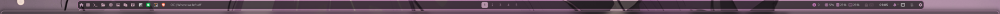
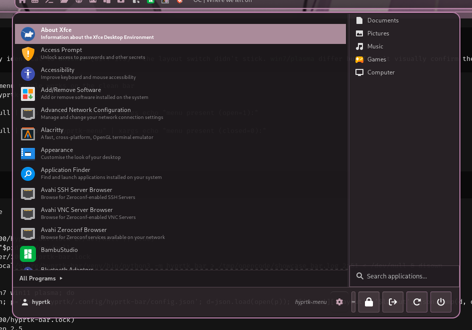
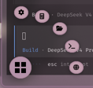
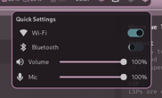
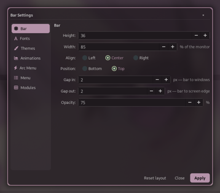

# Showcase

Screenshots of hyprtk-bar on a 3840x1080 display, captured on Hyprland. The
bar is themed live from the pywal16 palette of the current wallpaper.

All images live in [`assets/screenshots/`](assets/screenshots/).

---

## The taskbar

The default view — left section (start button, quick links, task list, active
window), centered workspaces, and the right cluster (updates, system monitor,
keyboard state, clock, notifications, tray, quick settings).

---

## Start menu

The in-bar application menu comes in four layouts, toggled from the start
button or `Super + Space`.

| Whisker | Windows 7 |
|---------|-----------|
|  |  |

| Windows 11 | Plasma |
|------------|--------|
|  |  |

---

## Arc menu

A radial launcher overlay (Android Material style) — a FAB fans out a ring of
app shortcuts. Toggled from `Super + Ctrl + M`.

---

## Quick settings

Wi-Fi and Bluetooth toggles, a volume slider with mute, mic level, and a
brightness slider (auto-hidden when no backlight device exists).

---

## System monitor

A Mission Center-style dialog (click the CPU/RAM readout in the bar): CPU,
Memory, Disks, Network, GPU and Apps pages with live graphs and readouts.

---

## Theme manager

The theming dialogue (click the wallpaper glyph): wallpaper picker, pywal
palette, rofi variants, bar themes, matuwall, swaylock, icons, and SDDM & GRUB.

---

## Settings

The floating settings window — bar geometry, fonts, themes, modules, and the
arc-menu and menu configuration tabs, all applied live.

---

## Notifications

A built-in `org.freedesktop.Notifications` daemon: floating toasts ...

... and a notification center with action buttons and "Clear all".

---

## Calendar

The clock's calendar popup, with the date shown on hover.

